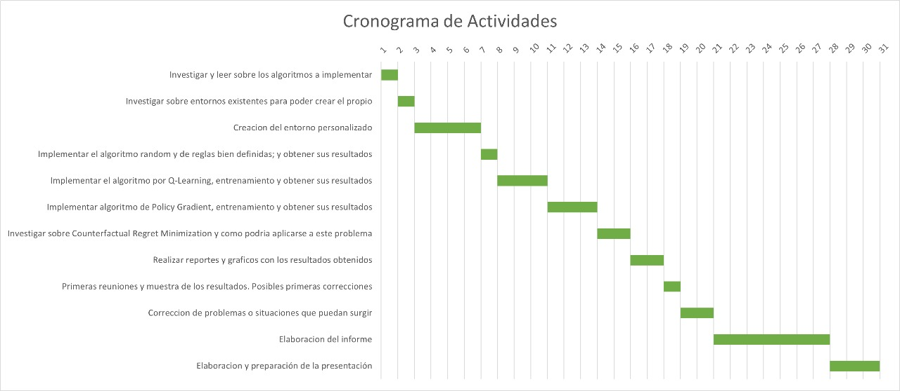

# Anteproyecto - Inteligencia Artificial 1

## **Truco-AI**: Agente jugador de Truco

### Integrantes: Renzo Dávila y Ramiro Martinez

### Descripcion:

#### Descripcion del Truco Argenitno
El truco argentino, considerado el juego de naipes más popular de Argentina y disputado con baraja española, es un claro ejemplo de un juego de información incompleta, ya que cada jugador desconoce por completo las cartas de sus oponentes. Su dinámica combina el valor de las cartas con una compleja psicología del engaño, articulada a través de un sistema de apuestas secuenciales como el "Envido" y el "Truco". Por esta razón, el objetivo final no es simplemente tener la mejor mano, sino ganar la mayor cantidad de puntos posibles, ya sea convenciendo al oponente de que se posee una jugada superior (incluso si no es cierto) o sabiendo cuándo retirarse a tiempo para minimizar las pérdidas.

#### El Problema para la IA
Desarrollar una inteligencia artificial para el truco es más complejo que para juegos de información perfecta como el ajedrez, donde siempre existe una "mejor jugada" evidente. El principal desafío radica en la toma de decisiones bajo incertidumbre, ya que el agente debe actuar constantemente sin conocer la mano del rival. Esto invalida las soluciones simples: un bot programado con reglas fijas (como "siempre cantar envido con 30 puntos") cae en la trampa de ser completamente predecible y, por ende, fácil de derrotar por un jugador experimentado. La dificultad fundamental es modelar la mentira; la estrategia óptima en el truco debe incluir el engaño y la capacidad de mentir, comportamientos que no pueden reducirse a una simple lógica de if-then-else, sino que requieren una comprensión contextual y adaptativa del oponente.

#### La Solución: Aprendizaje por Refuerzo (RL)
Usaremos Aprendizaje por Refuerzo (RL), la misma familia de algoritmos que domina el Go, el ajedrez y el póker.
Haremos algunos algoritmos para comparar los resultados. Como baseline tomares un algoritmo con reglas bien definidas, y luego implementaremos un algortimo aleatorio para ver como se comporta. Luego construiremos un agente de Q-Learning, el cual a pesar de no ser el mas adecuado a este tipo de problemas, sentimos que puede dar mejores resultados. Finalmente nos gustaria investigar sobre algun algoritmo mas orientado a este tipo de problemas, como Policy Gradient (tambien RL), o posiblemente el mejor para la situacion planteada: CRM (Counterfactual Regret Minimization).
El entrenamiento de estos algoritmos se basara en el juego de partidas consigo mismo. Es decir jugaran dos agentes de Q-Learning una partida

#### Metricas a tener en cuenta
Por supuesto que al ser un juego la metrica principal sera ganar la partida, siendo esto muy dificil de conseguir en este tipo de problema, ya que se necesita un altisimo nivel de entranamiento. Por eso nos basaremos mas en los puntos obtenidos, es decir que el agente defina una estrategia clara, y consiga a traves de esta algunos puntos. Otras metricas mas secundarias pero importantes pueden ser: cantidad de manos ganadas o jugadas, porcentaje de mentira y puntos perdidos.

#### Herramientas
Al ser un juego no conocido mundialmente no existen muchas herramientas que podamos usar, existen algunos entornos precarios desarrollados por entusiastas como "PyTruco", el cual se puede analizar y adaptar a nuestras necesidades. Igualmente de ser necesario existen miles de entornos de juegos como el Poker, que tambien pueden ser adaptadas a nuestras necesidades ya que ambos juegos comparten muchas simulitudes. A nivel de algoritmos, se puede usar la libreria "stable_baselines3" para comparar resultados o inclusive hacer uso de ella para entrenar diferentes modelos.

#### Justificacion

El Aprendizaje por Refuerzo (RL) es ideal para el Truco, aunque la elección del algoritmo es crucial. Un enfoque como Q-Learning, si bien sería claramente superior a un agente aleatorio (ya que al menos aprendería valores promedio, como "cantar envido con 33 es bueno"), no es la mejor solución. Q-Learning sufre en entornos de información incompleta como el Truco, pues no puede asignar un valor $Q(s,a)$ preciso a una acción si no conoce las cartas del oponente. En cambio, los métodos de Policy Gradient (PG) son mucho más aptos, ya que en lugar de aprender un valor, aprenden una política estocástica (una probabilidad para cada acción). Esto es perfecto para el Truco, pues permite al agente "descubrir" estrategias complejas como el farol, aprendiendo que a veces cantar "Truco" con cartas malas lleva a una victoria (recompensa) si el oponente se retira.

#### Cronograma de actividades [aproximadamente 30 dias]

* Investigar y leer sobre los algoritmos a implementar (1 dia)
* Investigar sobre entornos existentes para poder crear el propio (1 dia)
* Creacion del entorno personalizado (4 dias)
* Implementar el algoritmo random y de reglas bien definidas; y obtener sus resultados (1 dia)
* Implementar el algoritmo por Q-Learning, entrenamiento y obtener sus resultados (3 dias)
* Implementar algoritmo de Policy Gradient, entrenamiento y obtener sus resultados (3 dias)
* Investigar sobre Counterfactual Regret Minimization y como podria aplicarse a este problema (2 dias)
* Realizar reportes y graficos con los resultados obtenidos (2 dias)
* Primeras reuniones y muestra de los resultados. Posibles primeras correcciones (1 dia)
* Correccion de problemas o situaciones que puedan surgir (2 dias)
* Elaboracion del informe (7 dias)
* Elaboracion y preparación de la presentación (3 dias)

### Referencias:

[An Introduction to Counterfactual Regret Minimization](https://www.ma.imperial.ac.uk/~dturaev/neller-lanctot.pdf)

[Desafio: TrucoAnalytics](https://github.com/IAARhub/TrucoAnalytics)

[PyTruco](https://github.com/Ymil/PyTruco)

[TexasHoldemAgent](https://github.com/YiCheng996/TexasHoldemAgent/tree/main)

[Pluribus "open source"](https://github.com/keithlee96/pluribus-poker-AI/tree/develop)

[Stable-baselines3-PPO](https://stable-baselines3.readthedocs.io/en/master/modules/ppo.html)

[Implementaciones basadas en Q-Learning para el truco](https://github.com/tincho4t/truco-qlearningl)

