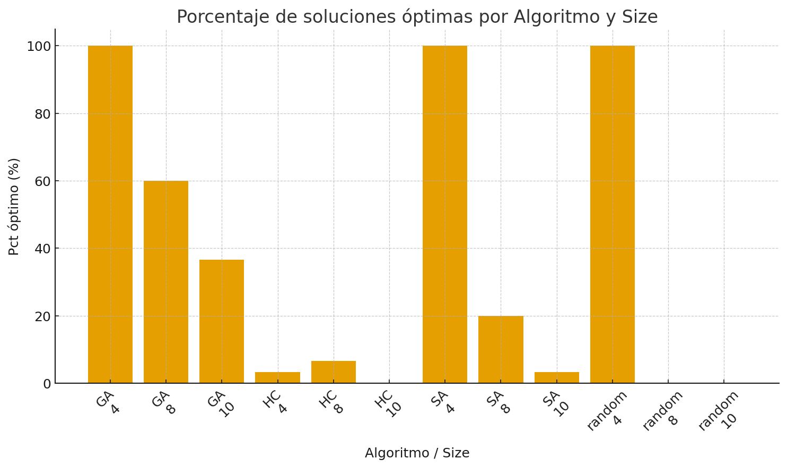
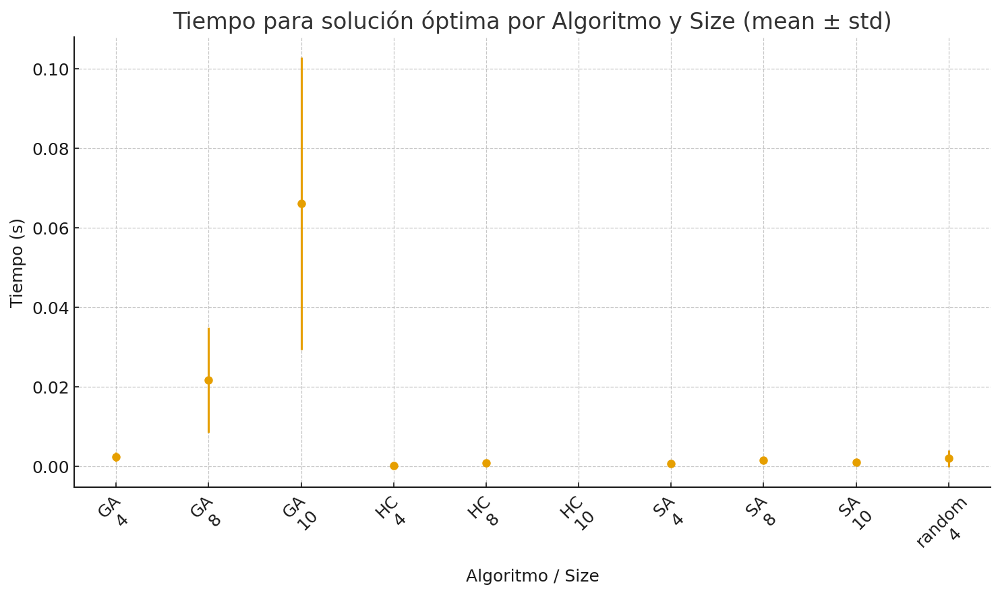
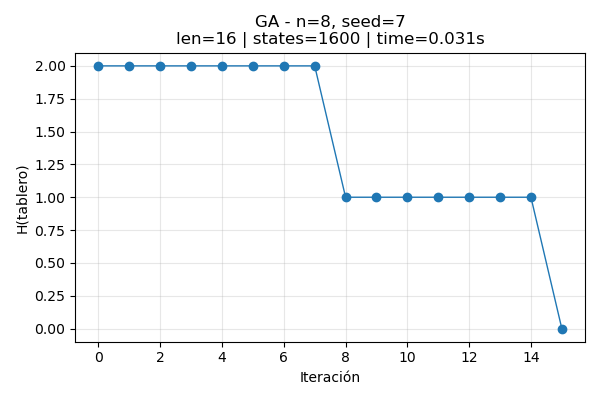
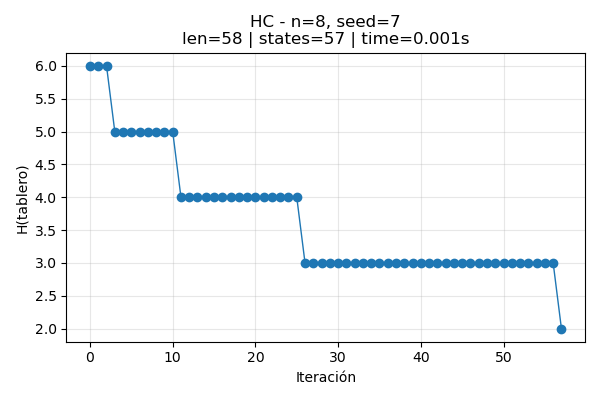
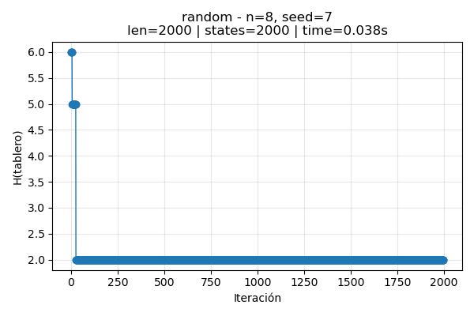
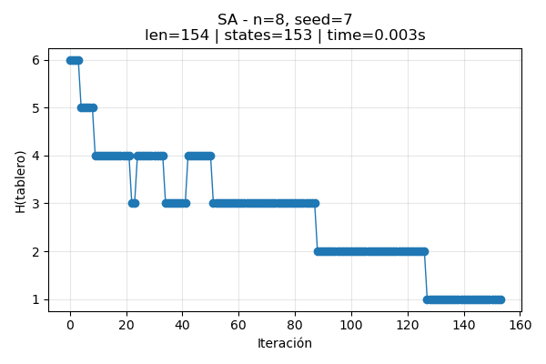

En este trabajo práctico trabajamos con 3 algoritmos los cuáles son: hill climbing, simulated annealing y algoritmos genéticos.

Para simulated annealing utilizamos como función de schedule un geométrico (multiplicativo) donde tenemos T ← T * factor_enfriamiento en cada iteración y T arranca como max(temperatura_inicial, temperatura_minima) y nunca se fuerza por debajo de temperatura_minima en el bucle (se corta antes).

En cuanto al algoritmo genético tenemos que cada individuo es una lista de longitud n de enteros en [0, n-1].
Interpretable como “en la columna j poner una pieza en la fila individuo[j]” generados aleatoriamente en cada ejecución.

Estrategia de selección: Torneo de tamaño k = 3 (o k = len(poblacion) si es menor a 3), se muestrean k índices al azar y se elige el mejor (menor h) como progenitor. El torneo se aplica independientemente para cada padre (no se evita repetición).

Estrategia de reemplazo: Generacional completa (sin elitismo explícito). En cada generación se construye una nueva población del mismo tamaño a partir de los hijos y reemplaza totalmente a la anterior.

Operadores: Cruzamiento: 1-punto con punto de corte en punto ∈ {1,…,n-1}: hijo = padre1[:punto] + padre2[punto:] (y simétrico para el segundo hijo), con probabilidad tasa_mutacion (definida por defecto en 0.25): Se elige una columna al azar y se asigna una fila aleatoria en [0, n-1] para esa columna.

el algoritmo se detiene cuando ocurre cualquiera de: Cantidad máxima de generaciones alcanzada: limite_generaciones u óptimo alcanzado: si el mejor valor observado es 0, se corta antes

En cuanto a los resultados obtenidos en las ejecuciones de los distintos algoritmos, podemos ver lo siguiente:

- **Porcentaje de óptimos (pct_optimo):** se ve qué algoritmos llegan al objetivo con mayor frecuencia. Los que están más altos son más confiables.
- **Conflictos promedio (h_mean_std):** mide cuán “limpias” son las soluciones. Más bajo es mejor; la barra de dispersión chica indica resultados estables.
- **Tiempo promedio (time_opt_mean):** muestra la rapidez **cuando hay solución**. Barras más bajas significan respuestas más rápidas.
- **Equilibrio:** el mejor algoritmo es el que combina **alto % de óptimos**, **bajo h** y **poco tiempo**.
- **Variabilidad:** si un método tiene barras de error grandes, su rendimiento cambia bastante entre ejecuciones.

---

## 1) Porcentaje de óptimos — *pct_optimo*

- Indica **qué tan seguido** cada algoritmo resuelve el problema.
- Úsalo para elegir **fiabilidad**: más alto = resuelve más casos.

## 2) Calidad media y dispersión — *h_mean_std*

- Valores **más bajos** significan **mejor calidad** (menos conflictos).
- La “línea/error” muestra **variación**: corto = resultados más consistentes.

## 3) Tiempo medio (solo en casos resueltos) — *time_opt_mean*

- Compara la **rapidez** entre algoritmos cuando **sí encuentran** solución.
- Útil para seleccionar **eficiencia** (tiempos bajos).

En cuanto al comportamiento de la función h, podemos ver que 

GA (Genetic Algorithm)

Curva: alta estabilidad al inicio y caída brusca en ~iter 8 a H≈1, luego otro salto a H=0 en la última iteración.
Explora “en paralelo” y, tras recombinaciones, encuentra un buen bloque de genes; la mutación/crossover produce el salto a solución. Resuelve el 8-reinas para seed=7; costo computacional moderado.

HC (Hill Climbing)

Curva: descensos escalonados con largos “plateaus” y final en H=2.
Mejora local constante pero se estanca en un mínimo local; es muy rápido y barato, pero no escapa. Excelente tiempo, no encuentra solución en esta ejecución.

Random

Curva: dos evaluaciones iniciales altas y luego se fija en H=2 toda la corrida.
Búsqueda ciega; el límite de iteraciones se consume sin progreso real tras el arranque. Sirve de línea base; peor uso de iteraciones/tiempo relativo.

SA (Simulated Annealing)

Curva: descensos con alguna subida puntual (aceptación por temperatura), y convergencia a H≈1.
La temperatura le permite escapar de mínimos (a diferencia de HC), pero en esta corrida no llega a 0. Buen compromiso exploración/explotación; casi solución y muy rápido.

Finalmente, vemos que si queremos llegar a una solución deberíamos optar por el uso de algoritmos genéticos, ya que si bien toman
varias iteraciones el peor de los resultados llega a ser un h = 1, en cambio, simulated annealing llega a un resultado "correcto" en 
una cantidad no muy grande de iteraciones, pero las soluciones que entrega están lejos de las de los AG. Por último, podemos ver
que si necesitamos un resultado relativamente bueno y rápido podríamos optar por utilizar hill climbing, aunque no resolvería el problema. 
