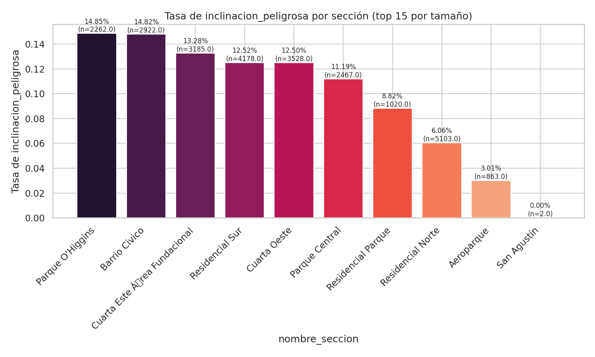
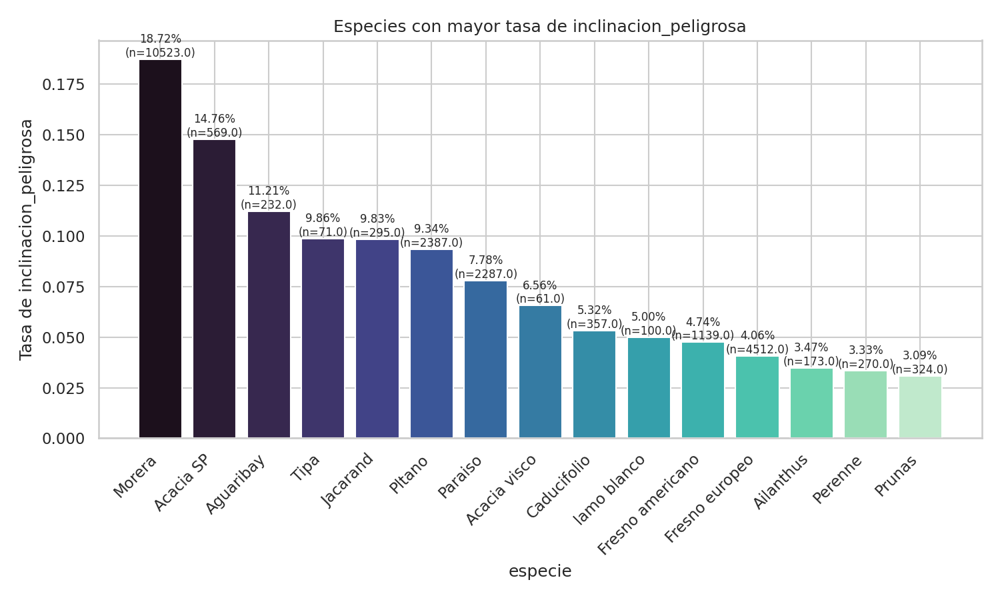
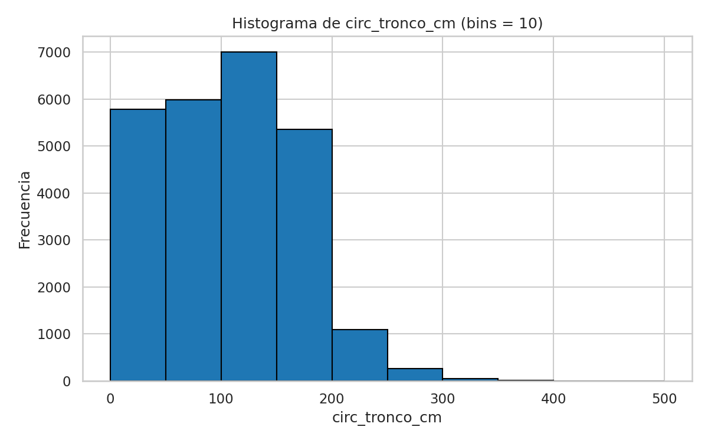
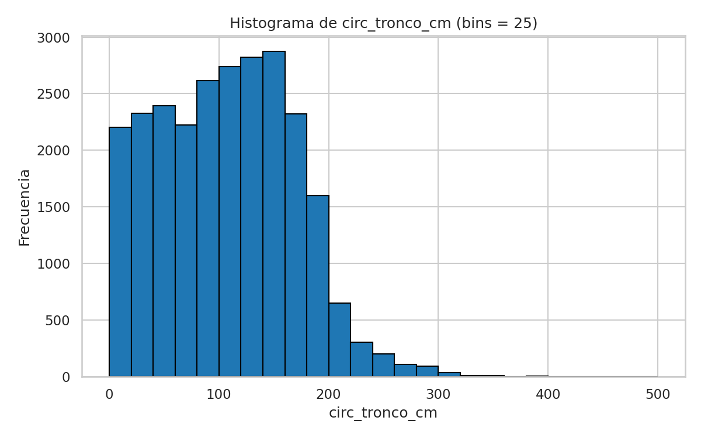
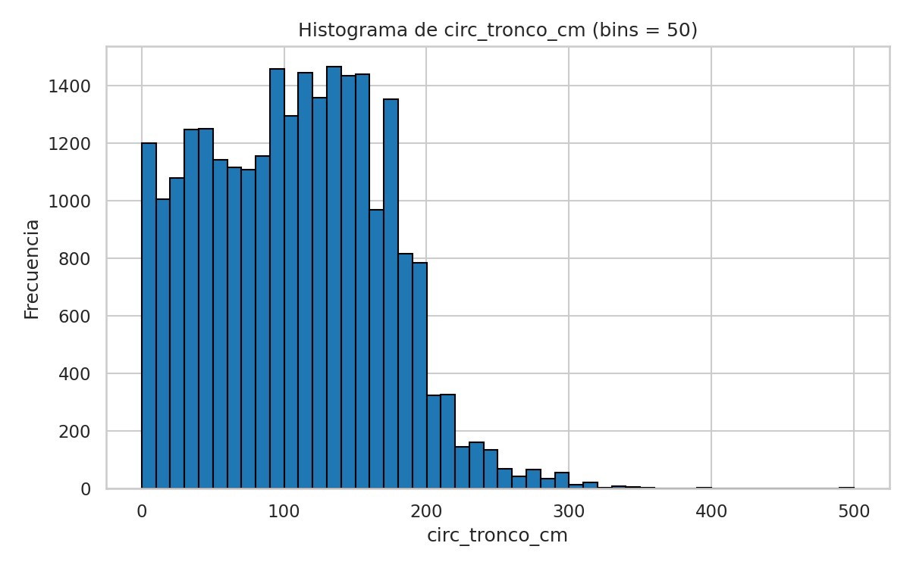
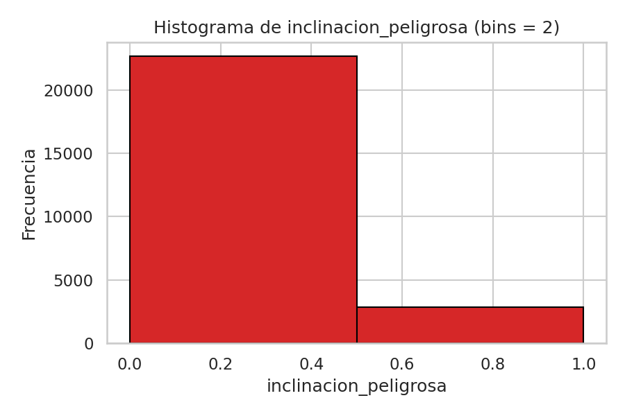
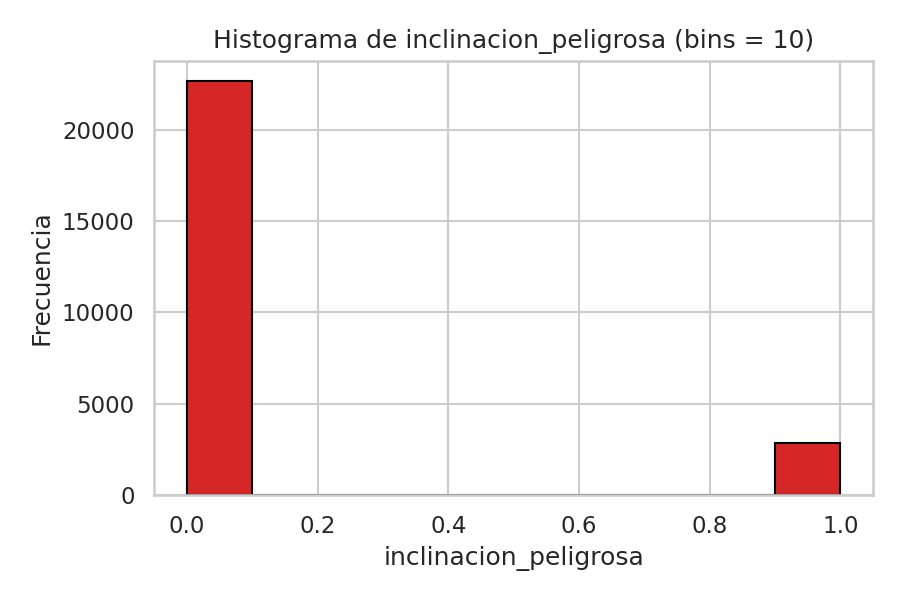

# Respuestas

## 2)

- a) En los datos podemos observar que aproximadamente un 88% de los arboles observados tienen una inclinación que no representa riesgos, mientras que el resto cuentan con inclinación peligros

- b) Podriamos decir que hay secciones más peligrosas que otras al haber un porcentaje mayor de árboles con inclinación peligrosa, por ejemplo el Parque O'Higgins y Barrio Civico cuentan con un 14.8%, a diferencia de Residencial Parque y Residencial Norte, que cuentan con un 8.82% y 6.06% respectivamente. 

- c) De la misma manera que en el item b), podriamos considerar a la Morera y a la Acacia SP como más peligrosas ya que cuentan con un 18.72% y 14.76% de arboles peligrosos respectivamente, comparado con el Fresno Europeo y Fresno Americano que se encuentran con un 4% aproximadamente.

# Visualizaciones

## Criterios de corte

En cuanto a los criterios de corte utilizados para clasificar las distintas circunferencias de los troncos, en base a la observación de los gráficos se decidio por usar los siguientes:
- Mayor a 0 --> Bajo
- Mayor a 100 --> Medio
- Mayor a 180 --> Alto
- Mayor a 260 --> Muy Alto
Luego viendo los datos, podemos ver que la mediana ronda 110 cm, el percentil 90 está cerca de 190 cm y el 99 cerca de 260 cm, por lo que los cortes resaltan los árboles de tronco especialmente grande sin dejar categorías vacías.

